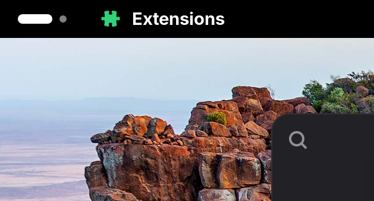

# App Name Indicator

A GNOME Shell extension that shows the active app's name and icon on the left side of the top panel, like it used to, before version 49.0.

## Installation
- Get it from the GNOME Extensions website: [GNOME Extensions page].
- Or manually install it: TODO
